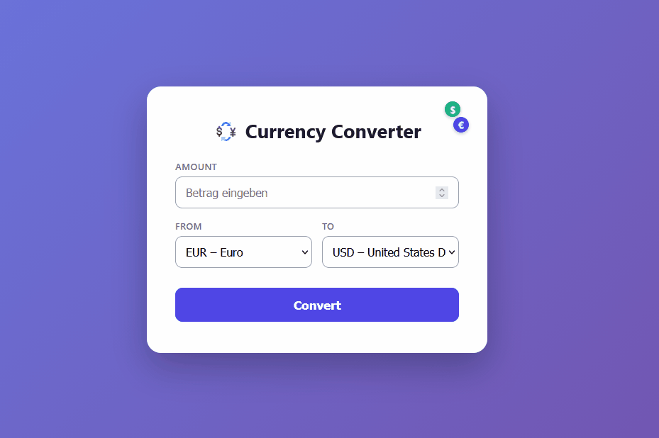

# 💱 Currency Converter

Ein Währungsrechner als REST-API mit Web-Oberfläche, gebaut mit **Spring Boot**. Er rechnet Beträge zwischen Währungen um – auf Basis tagesaktueller Wechselkurse der Europäischen Zentralbank – und speichert jede Umrechnung in einer Datenbank.



## Funktionen

- 🔄 Umrechnung zwischen ~30 Währungen mit tagesaktuellen Kursen
- 🌐 Live-Kurse über die [Frankfurter API](https://frankfurter.dev) (Datenquelle: Europäische Zentralbank)
- 💾 Speicherung jeder Umrechnung als Verlauf in einer H2-Datenbank
- 🖥️ Web-Oberfläche mit dynamisch geladener Währungsliste
- ✅ Saubere Fehlerbehandlung (ungültige Währung, gleiche Währung u. a.)
- 🎯 Exakte Geldbeträge dank `BigDecimal`, gerundet auf zwei Nachkommastellen

## Verwendete Technologien

| Bereich | Technologie |
|---|---|
| Sprache | Java 25 |
| Framework | Spring Boot 4.1.1 |
| Web / REST | Spring Web (`RestTemplate`) |
| JSON | Jackson |
| Persistenz | Spring Data JPA + H2 (In-Memory) |
| Build | Maven (via Maven Wrapper) |
| Frontend | HTML, CSS, Vanilla JavaScript |

## Voraussetzungen

- **Java 25** (JDK) muss installiert sein – [Download bei Adoptium](https://adoptium.net/temurin/releases)

Maven wird **nicht** separat benötigt – der mitgelieferte Maven Wrapper (`mvnw`) übernimmt das.

## Starten

Repository klonen und in den Projektordner wechseln:

```bash
git clone https://github.com/<dein-benutzername>/currencyconverter.git
cd currencyconverter
```

Anwendung direkt starten:

```bash
# Windows
.\mvnw.cmd spring-boot:run

# Linux / macOS
./mvnw spring-boot:run
```

Anschließend im Browser öffnen: **http://localhost:8080**

### Als ausführbare JAR bauen

```bash
# Windows
.\mvnw.cmd clean package

# Linux / macOS
./mvnw clean package
```

Die fertige Datei liegt danach unter `target/` und lässt sich eigenständig starten:

```bash
java -jar target/currencyconverter-0.0.1-SNAPSHOT.jar
```

## API-Endpunkte

### `GET /convert`

Rechnet einen Betrag von einer Währung in eine andere um und speichert das Ergebnis im Verlauf.

**Parameter**

| Name | Typ | Beschreibung |
|---|---|---|
| `from` | String | Ausgangswährung (z. B. `EUR`) |
| `to` | String | Zielwährung (z. B. `USD`) |
| `amount` | Zahl | Umzurechnender Betrag |

**Beispiel**

```
GET http://localhost:8080/convert?from=EUR&to=USD&amount=100
```

```json
{
  "from": "EUR",
  "to": "USD",
  "amount": 100.00,
  "rate": 1.1463,
  "result": 114.63
}
```

### `GET /history`

Gibt alle bisher gespeicherten Umrechnungen als Liste zurück.

```
GET http://localhost:8080/history
```

## Datenbank einsehen

Während die App läuft, ist die H2-Konsole erreichbar unter **http://localhost:8080/h2-console**

| Feld | Wert |
|---|---|
| JDBC URL | `jdbc:h2:mem:currencydb` |
| User Name | `sa` |
| Passwort | *(leer)* |

> **Hinweis:** Die Datenbank ist In-Memory – der gespeicherte Verlauf wird bei jedem Neustart der Anwendung zurückgesetzt.

## Projektstruktur

```
src/main/java/de/redon/currencyconverter/
├── CurrencyconverterApplication.java   # Einstiegspunkt
├── CurrencyController.java             # REST-Endpunkte (/convert, /history)
├── ConversionResult.java              # Antwort-Objekt der Umrechnung
├── ConversionEntry.java               # JPA-Entity (Verlaufseintrag)
├── ConversionRepository.java          # Datenbankzugriff (Spring Data JPA)
└── FrankfurterResponse.java           # Abbild der externen API-Antwort

src/main/resources/
├── application.properties             # Konfiguration
└── static/
    ├── index.html                     # Web-Oberfläche
    └── style.css                      # Gestaltung
```
